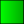
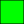
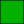
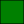
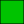

# Colors

## Gradient

&nbsp;
&nbsp;
&nbsp;
&nbsp;

**Web:** 0% `#00FF00` · 94% `#00AF00` · 98% `#008000`  
**RGB:** 0% `0 255 0` · 94% `0 175 0` · 98% `0 128 0`

## Pure Hacker Green

**Web:** `#00FF00`  
**RGB:** `0 255 0`  
**CMYK:** `72% 0% 100% 0%`

## Muted Hacker Green

**Web:** `#00c300`  
**RGB:** `0 195 0`

## White

**Web:** `#FFFFFF`  
**RGB:** `255 255 255`

## Pure Black

**Web:** `#000000`  
**RGB:** `0 0 0`  
**CMYK:** `0% 0% 0% 100%`

## Muted Black

**Web:** `#171717`  
**RGB:** `23 23 23`

## Watermark

**Web:** `rgba(255, 255, 255, 0.5)`  
**RGBA:** `255 255 255 50%`
