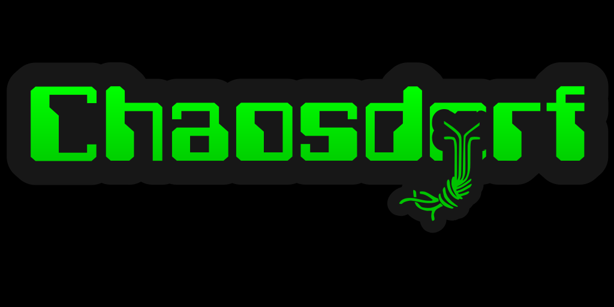

# Logos

## Chaosdorf with Chaosknoten

This logo is based on the Chaosknoten combined with the name written in
Computerfont.

The main full-color logo is should be used with caution as it calls for 
attention. It should not be used in print or for broadcast graphics.

A sticker version is available as well.

&nbsp;
&nbsp;

The monochrome logos are designed for use in print, laser-cut acrylic or as
watermarks on streams.

&nbsp;
&nbsp;

## Dorfhörnchen

This logo is based on the traditional Pesthörnchen.

The monochrome Dorfhörnchen is designed for use in print or laser-cut
acrylic.

A watermark version of the Dorfhörnchen, designed to be used as-is as
broadcast graphic on streams, is available as well.
