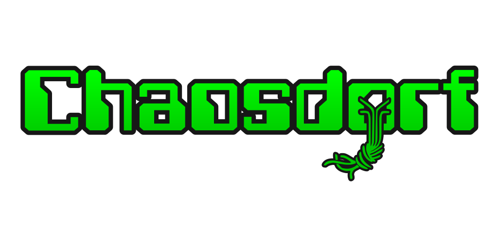
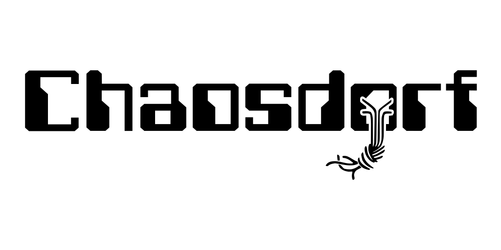
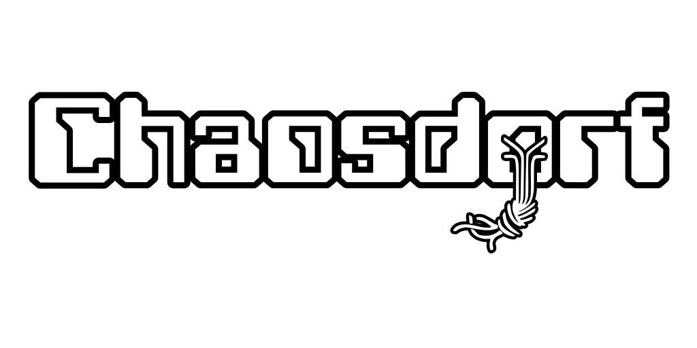
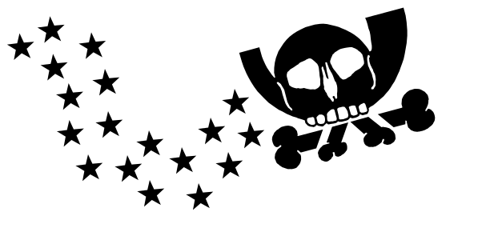

# Logos

## Chaosdorf with Chaosknoten

This logo is based on the Chaosknoten combined with the name written in
Computerfont.

The main, colorful logo is primarily designed for use on stickers and the web.
It should not be used in regular print or on streams.

The monochrome logos are designed for use in print, laser-cut acrylic or as
watermarks on streams.

&nbsp;
&nbsp;

## Dorfhörnchen

This logo is based on the traditional Pesthörnchen.

The monochrome Dorfhörnchen is designed for use in print or laser-cut
acrylic.

A watermark version of the Dorfhörnchen, designed to be used as-is as
broadcast graphic on streams, is available as well.
